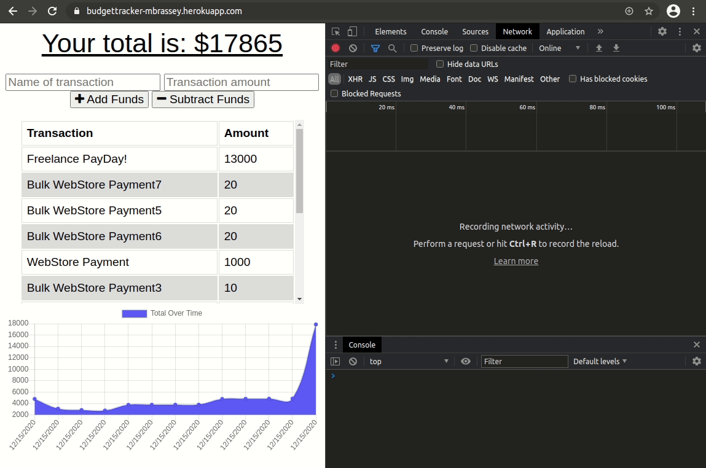
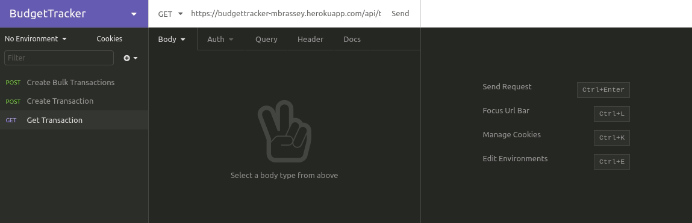

## OfflineReady

I've updated an existing budget tracker application to allow for offline access and functionality. The user is now able to add expenses and deposits to their budget with or without a network connection, transforming it to a Progressive Web Application (PWA). If the user enters transactions offline, the total is updated when they're brought back online. This was accomplished using IndexedDB to handle offline transactions and a configure Service Worker to cache webapp assets for offline use.

#### Issues

- [x] [IndexedDB](https://github.com/MBrassey/OfflineReady/issues/1)
- [x] [Add Service Worker](https://github.com/MBrassey/OfflineReady/issues/2)
- [x] [Deploy to Heroku & MongoDB Atlas](https://github.com/MBrassey/OfflineReady/issues/3)
- [x] [Create Readme](https://github.com/MBrassey/OfflineReady/issues/4)

#### Requirements

    MongoDB Community Server
    node
    npm

#### Installation

    install MongoDB
    npm i

#### Usage

    npm run start
    browse: localhost:3001/
    use insomnia to test routes

<h6>
:cyclone: Click the image(s) below to view the live <a id="Screenshots" href="https://budgettracker-mbrassey.herokuapp.com/api/transaction">webapplication</a>
</h6>

> Application Demonstration
> 

> Routes
> 

#### Questions

Contact me at [matt@brassey.io](mailto:matt@brassey.io) with any questions or comments.

#### License

`OfflineReady` is published under the **CC0_1.0_Universal** license.

> The Creative Commons CC0 Public Domain Dedication waives copyright interest in a work you've created and dedicates it to the world-wide public domain. Use CC0 to opt out of copyright entirely and ensure your work has the widest reach. As with the Unlicense and typical software licenses, CC0 disclaims warranties. CC0 is very similar to the Unlicense.
